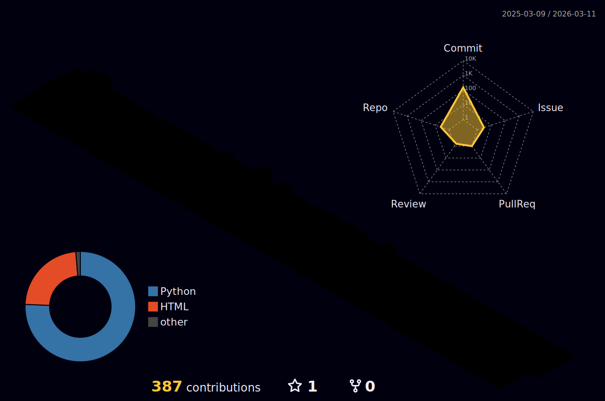

  <!-- dynamic typing effect 动态打字效果 -->

  [;Welcome to my Github!&center=true&size=27>)](https://git.io/typing-svg)

  <!-- knock code pictures 敲代码的图片 -->
<picture>
  
</picture>

  <!-- for beauty 留个空行好看点 -->
  
&nbsp;

  <!-- profile logo 个人资料徽标 -->
  

    <!-- &emsp; -->
    <!-- &emsp; -->
    <!-- &emsp; -->
    <!-- &emsp; -->
    &emsp;
    &emsp;
    <!-- visitor -->
    &emsp;
    <!-- wakatime -->    
    <!--  -->

  

  <!-- Snake Code Contribution Map 贪吃蛇代码贡献图 -->
  <picture>
    
  </picture>

<table>
  
<tr><td>

### 🙋 About Me

<!--  -->

&emsp;&emsp;👋 Hello! I'm Yifan Liang, a first-year graduate student from Huazhong University of Science and Technology(HUST).

&emsp;&emsp;🎓 I major in Intelligence Science and Technolgy, supervised by Prof. Xiang Xiang.

&emsp;&emsp;🔬 My study interests lies in <strong>Trustworthy AI System</strong>, including out-of-distribution detection, multimodal content understanding, and so on.

&emsp;&emsp;😃 Researchers are welcome to communicate and collaborate!

<!-- 
&emsp;&emsp;<strong>We're making the world a better place. Through constructing elegant hierarchies for maximum code reuse and extensibility.</strong>
 -->

</td></tr>

<tr><td>

### 🏫 Study Experience

<!--  -->

- [华中科技大学人工智能与自动化学院](https://aia.hust.edu.cn/) &emsp; 📌 2025-09 —— 2028-06(Expected)

  - School：School of Artificial Intelligence and Automation(AIA)
  - Major：Intelligence Science and Technolgy
  - Degree: Master(Expected)

<!--  -->

- [华中科技大学人工智能与自动化学院](https://aia.hust.edu.cn/) &emsp; 📌 2021-09 —— 2025-06

  - School：School of Artificial Intelligence and Automation(AIA)
  - Major：Artificial Intelligence
  - Degree: Bachelor

</td></tr>

<tr><td>

</td></tr>

</table>

<!-- ########################################## 分割 ########################################## -->

<!-- github-readme-streak-stats 连续提交代码天数记录 -->

<picture>
  
</picture>

<!-- metrics 基础资料 -->

<!-- GitHub Activity Graph GitHub 活动图 -->
<table>
  <tr>
    <td>
      <picture>
        
      </picture>
  </tr>
</table>

<!-- ########################################## 分割 ########################################## -->

  
<!-- GitHub 奖杯🏆 -->

 

<!-- GitHub 数据统计 -->

 

<!-- Wakatime Graph-->
<table>
  <tr>
    <td></td>
    <td></td>
  </tr>
</table>

<!-- ########################################## 分割 ########################################## -->

<!--  skill badge 技能徽章 -->

<!-- svg and gif-->

<!-- profile-3d-contrib 3D 贡献图-->
<picture>
  
</picture>

<!-- ########################################## 分割 ########################################## -->

### Github Metrics
<!-- GitHub metrics 信息指标 -->

<!-- first form 第一个表格 -->
<table>
  <tr>
    <td></td>
  </tr>
</table>

<!-- second form 第二个表格 -->
<table>
  <tr>
    <td></td>
    <td></td>
  </tr>
  <tr>
    <td></td>
    <td></td>
  </tr>
  <tr>
    <td></td>
    <td></td>
  </tr>
  <tr>
    <td></td>
    <td></td>
  </tr>
  <tr>
    <td></td>
    <td></td>
  </tr>
  <tr>
    <td></td>
    <td></td>
  </tr>
</table>

<!--  -->

<!-- just img 图片 -->

